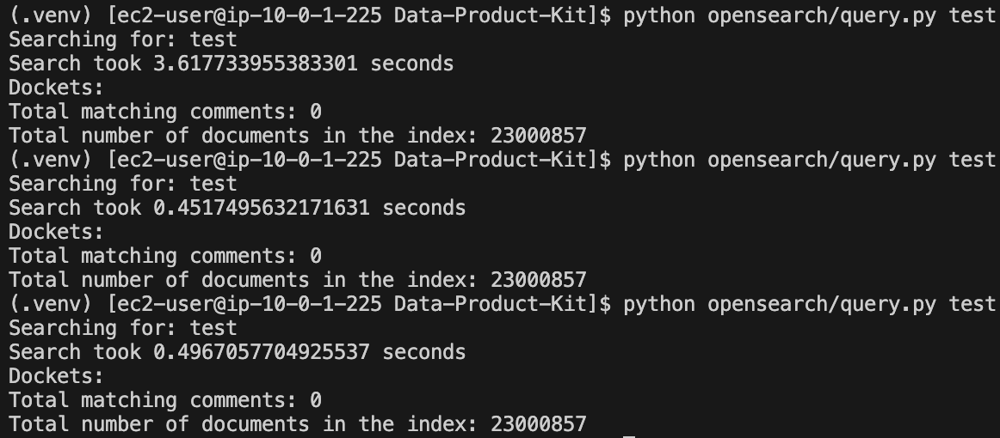

# Querying 23 Million Comments

In the full regulations.gov dataset, there are close to 23 million comments. We want to ensure that our current data structure for OpenSearch will allow all of these results to be queried fast enough that the user will not experience a significant delay (less than a second is necessary, faster would be ideal).

To determine this, we added 23 million comments to a cloud instance of Amazon OpenSearch Serverless. Note that the time taken to query this many comments in a dev environment is not really relevant, as a user will never do this and a developer would likely have no need for this as well.

The 23 million comments were actually 1000 comments repeated 23000 times. There were also an additional 857 comments that appeared in the database somehow, but we are not sure exactly how that happened. At the end of each DocketID and CommentID, we appended a different number. This is to ensure that OpenSearch does not see these entries as duplicates and speed up the search process as a result of that. The following screenshots show the results of several consecutive queries of the same search term:

We see that in both cases, the first time the term was searched, the query took just under 4 seconds. On subsequent queries of the same term, the query took under half a second, which is fast enough. The reason for this speedup is AOSS caching, in which repeated search terms take less time because AOSS stores results to optimize performance.

Thus, we see that our structure can be queried fast enough for a user to get results with no noticeable delay (following the initial search of that term). No changes to the database structure are recommended.